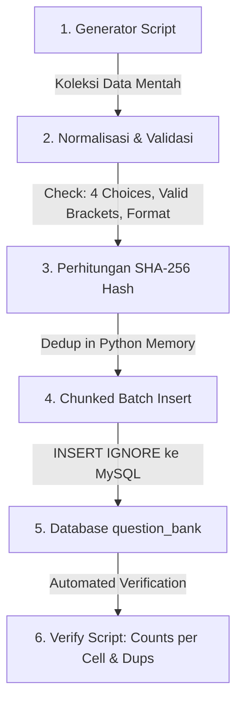

# 📚 Panduan Lengkap: Dari Generasi Soal hingga Seeding Database (MySQL)

Dokumen ini menjelaskan alur kerja, standar format, teknik generasi, penulisan penjelasan (*explanation*) & tips belajar (*learning tip*), deduplikasi, dan seeding bank soal bahasa Inggris (IELTS / CEFR) ke dalam database MySQL/MariaDB pada proyek **Ruang Kata**.

---

## 📑 Daftar Isi
1. [Arsitektur & Matriks Bank Soal](#1-arsitektur--matriks-bank-soal)
2. [Standar Penulisan Explanation & Learning Tip](#2-standar-penulisan-explanation--learning-tip)
3. [Standar & Anatomi Format JSON Soal](#3-standar--anatomi-format-json-soal)
4. [Prinsip Desain & Kualitas Konten](#4-prinsip-desain--kualitas-konten)
5. [Sistem Keunikan & Hashing (SHA-256)](#5-sistem-keunikan--hashing-sha-256)
6. [Skema Database MySQL](#6-skema-database-mysql)
7. [Pipeline Step-by-Step (Generate ➔ Cleanse ➔ Seed ➔ Verify)](#7-pipeline-step-by-step)
8. [Contoh Template Generator Python](#8-contoh-template-generator-python)
9. [Verifikasi Kualitas & Unit Testing](#9-verifikasi-kualitas--unit-testing)
10. [Implementasi Seed CEFR 1.000 pada Aplikasi](#10-implementasi-seed-cefr-1000-pada-aplikasi)
11. [Konfigurasi Server & Environment Deployment](#11-konfigurasi-server--environment-deployment)

---

## 1. Arsitektur & Matriks Bank Soal

Bank soal disusun dalam bentuk matriks **Level (CEFR) × Tipe Soal (Skill)**:

- **6 Tingkat CEFR**: `A1`, `A2`, `B1`, `B2`, `C1`, `C2`
- **5 Tipe Soal Utama**:
  1. `vocabulary` (Kosakata & Kolokasi Akademik)
  2. `reading` (Pemahaman Bacaan Berdasarkan Konteks)
  3. `fill_blank` (Tata Bahasa / Grammar Cloze)
  4. `listening` (Pemahaman Percakapan Audio/Transkrip)
  5. `error_identification` (Menemukan Bagian Kalimat yang Salah)
- **Target Kuota**: Tepat **1.000 soal unik per sel (Level × Skill)**:
  $$\text{Total Target} = 6 \text{ Level (A1–C2)} \times 5 \text{ Skill} \times 1.000 \text{ Soal} = \mathbf{30.000\text{ Soal Unik}}$$

### Pemetaan Level CEFR ke Target Band IELTS
| Level CEFR | Deskripsi Kemampuan | Target Band IELTS |
|---|---|---|
| **A1** | Pemula dasar (*Beginner*) | **4.0** |
| **A2** | Dasar lanjutan (*Elementary*) | **4.5** |
| **B1** | Menengah (*Intermediate*) | **5.0 – 5.5** |
| **B2** | Menengah atas (*Upper Intermediate*) | **6.0 – 6.5** |
| **C1** | Tingkat mahir (*Advanced*) | **7.0 – 7.5** |
| **C2** | Penutur fasih / profesional (*Proficiency*) | **8.0 – 9.0** |

---

## 2. Standar Penulisan Explanation & Learning Tip

> [!TIP]
> **Prinsip Dasar**: Penjelasan harus **singkat (1–2 kalimat)**, langsung menjelaskan **mengapa** jawaban tersebut benar tanpa bertele-tele, serta menyertakan tips praktis yang mudah diingat oleh pembelajar.

### Panduan Format per Skill:

### A. Vocabulary
- **Explanation**: Jelaskan arti kata dalam konteks kalimat tersebut dan alasan mengapa opsi lain kurang tepat.
- **Learning Tip**: Tuliskan pola kolokasi (*collocation*), pasangan kata, atau kategori kata akademik (*AWL*).
- **Contoh**:
  - *Explanation*: `"Jawaban yang tepat adalah 'mitigate' karena berarti mengurangi tingkat keparahan dampak negatif lingkungan."`
  - *Learning Tip*: `"Kuasai kolokasi akademik: 'mitigate impact' / 'mitigate risk'."`

### B. Fill Blank (Grammar)
- **Explanation**: Sebutkan nama aturan grammar / tense yang digunakan dan penanda waktu / subjek yang mendasarinya.
- **Learning Tip**: Tuliskan rumus singkat atau formula pola grammar.
- **Contoh**:
  - *Explanation*: `"Gunakan 'had already left' (Past Perfect) karena aksi meninggalkan ruangan terjadi sebelum pengumuman selesai di masa lampau."`
  - *Learning Tip*: `"Pola: By the time + Past Simple, Subjek + Past Perfect (had + V3)."`

### C. Reading Comprehension
- **Explanation**: Sebutkan kalimat bukti langsung (*evidence*) dari teks yang menjawab pertanyaan.
- **Learning Tip**: Berikan strategi membaca cepat (*skimming/scanning*) atau identifikasi kata kunci (*keyword matching*).
- **Contoh**:
  - *Explanation*: `"Teks menyatakan bahwa 'vegetasi yang berkurang menjadi penyebab utama panas kota', sehingga opsi A benar."`
  - *Learning Tip*: `"Perhatikan kata kunci penjelas sebab-akibat seperti 'due to', 'primarily caused by'."`

### D. Listening Comprehension
- **Explanation**: Jelaskan fakta spesifik yang diucapkan oleh penutur di dalam dialog/monolog.
- **Learning Tip**: Fokus pada kata sinyal percakapan atau respon persetujuan/penolakan.
- **Contoh**:
  - *Explanation*: `"Petugas perpustakaan menyatakan bahwa perpanjangan kartu hanya membutuhkan kartu tanda mahasiswa dan formulir singkat."`
  - *Learning Tip*: `"Dengarkan jawaban langsung setelah pertanyaan 'What do I need to bring?'."`

### E. Error Identification
- **Explanation**: Tunjukkan bagian kata yang salah, alasan kesalahannya, dan bentuk perbaikan yang seharusnya.
- **Learning Tip**: Ingatkan aturan umum grammar (misal: *subject-verb agreement*, *adjective vs adverb*, *modal auxiliary*).
- **Contoh**:
  - *Explanation*: `"Kata 'slow' salah karena menerangkan kata kerja 'walked'. Bentuk yang benar adalah adverb 'slowly'."`
  - *Learning Tip*: `"Gunakan akhiran -ly (adverb) untuk menerangkan tindakan (verb), bukan adjective."`

---

## 3. Standar & Anatomi Format JSON Soal

Setiap soal disimpan dalam format JSON terstruktur di dalam kolom `question_json`.

### A. Vocabulary
```json
{
  "id": "auth-vocab-b2-0001",
  "type": "vocabulary",
  "level": "B2",
  "ielts_target": 6.5,
  "prompt": "The local council implemented measures to _____ the environmental impact of urban expansion.",
  "choices": ["mitigate", "aggravate", "replicate", "abandon"],
  "correctIndex": 0,
  "explanation": "Jawaban yang tepat adalah 'mitigate' karena berarti mengurangi keparahan dampak negatif lingkungan.",
  "learningTip": "Kuasai kata akademik (AWL): mitigate = lessen severity / reduce impact.",
  "ieltsSkill": "Lexical Resource"
}
```

### B. Reading
```json
{
  "id": "auth-reading-b1-0001",
  "type": "reading",
  "level": "B1",
  "ielts_target": 5.5,
  "context": "Urban heat islands occur when metropolitan areas experience significantly warmer temperatures than surrounding rural regions, primarily due to dense human structures and reduced vegetative cover.",
  "prompt": "What is the primary cause of higher temperatures in urban areas according to the text?",
  "choices": [
    "Dense human structures and reduced vegetation",
    "Extreme weather events in coastal regions",
    "Excessive rainfall during summer months",
    "High altitude of modern city centres"
  ],
  "correctIndex": 0,
  "evidence": "primarily due to dense human structures and reduced vegetative cover",
  "explanation": "Teks secara eksplisit menyebutkan struktur padat dan berkurangnya vegetasi sebagai penyebab utama kenaikan suhu.",
  "learningTip": "Cari kata kunci sebab-akibat ('due to', 'because of') di dalam teks bacaan.",
  "ieltsSkill": "Reading Comprehension"
}
```

### C. Fill Blank (Grammar)
```json
{
  "id": "auth-fill-a2-0001",
  "type": "fill_blank",
  "level": "A2",
  "ielts_target": 4.5,
  "prompt": "By the time the manager arrived at the office, the meeting _____ already started.",
  "choices": ["had", "has", "is", "was"],
  "correctIndex": 0,
  "explanation": "Struktur Past Perfect ('had + V3') digunakan karena rapat dimulai sebelum manajer tiba di masa lampau.",
  "learningTip": "Klausa 'by the time + Past Simple' berpasangan dengan Past Perfect (had + V3).",
  "ieltsSkill": "Grammatical Range and Accuracy"
}
```

### D. Listening
```json
{
  "id": "auth-listening-c1-0001",
  "type": "listening",
  "level": "C1",
  "ielts_target": 7.5,
  "context": "Professor: The initial data set suggests a correlation between sleep quality and executive function, though longitudinal verification remains imperative.\nStudent: Should we incorporate cognitive testing in phase two?\nProfessor: Precisely. That will isolate the neurological variables.",
  "prompt": "What will the research team do in the second phase of the study?",
  "choices": [
    "Incorporate cognitive testing to isolate neurological variables",
    "Abandon the initial correlation findings",
    "Publish the results without further verification",
    "Replace the current participant sample"
  ],
  "correctIndex": 0,
  "explanation": "Profesor menyetujui usulan penambahan cognitive testing untuk mengisolasi variabel neurologis.",
  "learningTip": "Perhatikan kata persetujuan seperti 'Precisely' atau 'Exactly' dalam dialog listening.",
  "ieltsSkill": "Listening Comprehension"
}
```

### E. Error Identification (Aturan Khusus)
> [!IMPORTANT]
> **Aturan Format Error Identification**:
> 1. Kalimat pada `prompt` **wajib** menandai 4 kata/frasa target menggunakan tanda kurung siku `[kata]`.
> 2. `choices` harus berupa array kata bersih tanpa kurung: `["kata1", "kata2", "kata3", "kata4"]`.
> 3. Jangan gunakan kurung huruf `[A]`, `[B]` agar tampilan interaktif UI tidak menampilkan huruf ganda (`A A ... B B ...`).
> 4. `correctIndex` menunjuk pada pilihan yang memuat kesalahan grammar.

```json
{
  "id": "auth-err-b2-0001",
  "type": "error_identification",
  "level": "B2",
  "ielts_target": 6.5,
  "prompt": "Neither the head physician nor the senior [surgeons] [was] able to [perform] the complex operation [without] specialized assistance.",
  "choices": ["surgeons", "was", "perform", "without"],
  "correctIndex": 1,
  "explanation": "Pada pola 'neither...nor', kata kerja mengikuti subjek terdekat ('surgeons' = jamak), sehingga bentuk yang benar adalah 'were', bukan 'was'.",
  "learningTip": "Subjek terdekat pada paired conjunction menentukan singular/plural verb.",
  "ieltsSkill": "Grammatical Range and Accuracy"
}
```

---

## 4. Prinsip Desain & Kualitas Konten

| Karakteristik | ❌ Anti-Pattern (Hindari) | ✅ Best Practice (Gunakan) |
|---|---|---|
| **Konteks Kalimat** | Menggunakan template generic seperti `"Practice 01"`, `"Variant 200"`, atau dummy kata. | Kalimat akademik, profesional, ilmiah, atau situasi kehidupan nyata yang otentik. |
| **Pilihan Distraktor** | Opsi sembarangan seperti `"option A"`, `"option B"`, atau kata yang tidak nyambung. | Distraktor yang masuk akal secara leksikal/gramatikal namun tetap memiliki 1 jawaban mutlak benar. |
| **Distribusi Jawaban** | Kunci jawaban selalu A (`correctIndex: 0`) pada semua soal. | Distribusi seimbang ~25% pada index 0 (A), 1 (B), 2 (C), dan 3 (D). |
| **Penjelasan (`explanation`)** | Kosong atau hanya `"Jawaban A benar."` | Penjelasan logis mengapa opsi tersebut benar dan aturan tata bahasa/makna di baliknya. |

---

## 5. Sistem Keunikan & Hashing (SHA-256)

Untuk mencegah duplikasi pada saat seeding massal puluhan ribu baris, sistem menggunakan formula deterministik SHA-256:

$$\text{Key} = \text{prompt} + \text{"\|"} + \text{join}(\text{choices}, \text{"\|"})$$
$$\text{Content Hash} = \text{SHA256}(\text{level} + \text{"\textbackslash x00"} + \text{ielts\_target} + \text{"\textbackslash x00"} + \text{Key})$$

- Pada MySQL, kolom `content_hash` memiliki indeks `UNIQUE`.
- Menggunakan perintah `INSERT IGNORE INTO question_bank ...` menjamin proses seeding bersifat **idempoten** (dapat diulang kapan saja tanpa merusak data yang sudah ada).

---

## 6. Skema Database MySQL

```sql
CREATE TABLE IF NOT EXISTS `question_bank` (
  `id` BIGINT UNSIGNED NOT NULL AUTO_INCREMENT,
  `content_hash` VARCHAR(64) NOT NULL,
  `level` VARCHAR(8) NOT NULL,
  `ielts_target` DECIMAL(3,1) NOT NULL DEFAULT 4.0,
  `type` VARCHAR(32) NOT NULL,
  `source` VARCHAR(32) NOT NULL DEFAULT 'authentic_curated',
  `question_json` LONGTEXT NOT NULL,
  `active` TINYINT(1) NOT NULL DEFAULT 1,
  `created_at` DATETIME NOT NULL DEFAULT CURRENT_TIMESTAMP,
  PRIMARY KEY (`id`),
  UNIQUE KEY `idx_content_hash` (`content_hash`),
  KEY `idx_level_type_source` (`level`, `type`, `source`),
  KEY `idx_active` (`active`)
) ENGINE=InnoDB DEFAULT CHARSET=utf8mb4 COLLATE=utf8mb4_unicode_ci;
```

---

## 7. Pipeline Step-by-Step



### Langkah 1: Siapkan Generator Python
Kompilasi bank pertanyaan di script generator (misal `a1_gen.py`, `b1_gen.py`, dll.) dengan struktur dictionary / tuple data berkualitas tinggi.

### Langkah 2: Jalankan Deduplikasi & Formatting Script
Pastikan:
- `error_identification` prompt memiliki 4 penanda bracket `[word]`.
- Tidak ada bracket di dalam array `choices`.
- Menghapus awalan prompt yang redundan (`"Identify the error in the sentence:"`).
- Menyertakan `explanation` dan `learningTip` yang ringkas dan mudah dipahami.

### Langkah 3: Eksekusi Batch Insert
Kirim batch insert dengan chunking untuk mencegah koneksi timeout:
```python
if len(chunk_data) >= 100:
    cur.executemany(INSERT_SQL, chunk_data)
    conn.commit()
    chunk_data = []
```

### Langkah 4: Jalankan Verifikasi DB
Jalankan verifikasi untuk memastikan setiap sel memenuhi kuota tepat 1.000 soal unik:
```bash
python scratch/generator/verify_db.py
```

---

## 8. Contoh Template Generator Python

Berikut adalah template standar Python yang digunakan untuk menghasilkan dan men-seed soal secara andal:

```python
import mysql.connector
import json
import hashlib
import re

DB_CONFIG = {
    "host": "100.86.12.111",
    "port": 3306,
    "user": "cloudbeaver",
    "password": "passwordmu",
    "database": "english_practice",
    "charset": "utf8mb4"
}

def compute_hash(level: str, ielts_target: float, prompt: str, choices: list[str]) -> str:
    key = prompt + "|" + "|".join(choices)
    raw = f"{level}\x00{ielts_target:.1f}\x00{key}".encode("utf-8")
    return hashlib.sha256(raw).hexdigest()

def seed_questions(items: list[dict]):
    conn = mysql.connector.connect(**DB_CONFIG)
    cur = conn.cursor()
    
    insert_sql = """
    INSERT IGNORE INTO question_bank
      (content_hash, level, ielts_target, type, source, question_json, active, created_at)
    VALUES (%s, %s, %s, %s, %s, %s, TRUE, NOW())
    """
    
    batch = []
    inserted = 0
    
    for q in items:
        lvl = q["level"]
        typ = q["type"]
        target = q.get("ielts_target", 4.0)
        prompt = q["prompt"].strip()
        choices = [str(c).strip() for c in q["choices"]]
        
        # Validasi khusus Error Identification
        if typ == "error_identification":
            choices = [re.sub(r'^\[(.+)\]$', r'\1', c) for c in choices]
            prompt = re.sub(r'^(Identify the (incorrect part|error)|Choose the error):\s*', '', prompt, flags=re.I).strip()
            
        h = compute_hash(lvl, target, prompt, choices)
        
        qj = {
            "id": f"auth-{lvl.lower()}-{typ}-{h[:8]}",
            "type": typ,
            "level": lvl,
            "ielts_target": target,
            "prompt": prompt,
            "choices": choices,
            "correctIndex": q.get("correctIndex", 0),
            "context": q.get("context", ""),
            "evidence": q.get("evidence", ""),
            "explanation": q.get("explanation", ""),
            "learningTip": q.get("learning_tip", q.get("learningTip", "")),
            "ieltsSkill": q.get("ielts_skill", ""),
            "reviewKey": prompt + "|" + "|".join(choices)
        }
        
        batch.append((h, lvl, target, typ, "authentic_curated", json.dumps(qj, ensure_ascii=False)))
        
        if len(batch) >= 100:
            cur.executemany(insert_sql, batch)
            conn.commit()
            inserted += cur.rowcount
            batch = []
            
    if batch:
        cur.executemany(insert_sql, batch)
        conn.commit()
        inserted += cur.rowcount
        
    print(f"Berhasil men-seed {inserted} soal ke database.")
    cur.close()
    conn.close()
```

---

---

## 9. Verifikasi Kualitas & Unit Testing

Setelah seeding selesai, validasi dilakukan melalui 3 tahap pengujian:

### A. Validasi Matriks Kuota & Keunikan Prompt (SQL)
```sql
SELECT level, type, COUNT(*) as total_soal,
       COUNT(DISTINCT JSON_UNQUOTE(JSON_EXTRACT(question_json, '$.prompt'))) as total_unik
FROM question_bank
WHERE source = 'cefr_1000' AND active = TRUE
GROUP BY level, type
ORDER BY level, type;
```

### B. Validasi Keunikan Pola Konteks Reading & Listening (SQL CTE Normalized Pattern)
Untuk menjamin bahwa teks bacaan (*reading passages*) dan transkrip audio (*listening scripts*) tidak menggunakan template berulang yang hanya mengubah angka, terapkan query CTE validasi pola normalisasi berikut:

```sql
WITH normalized_questions AS (
    SELECT
        id,
        level,
        ielts_target,
        type,
        source,
        JSON_UNQUOTE(JSON_EXTRACT(question_json, '$.context')) AS original_context,
        TRIM(
            REGEXP_REPLACE(
                REGEXP_REPLACE(
                    LOWER(JSON_UNQUOTE(JSON_EXTRACT(question_json, '$.context'))),
                    '[0-9]+([:.][0-9]+)?',
                    '{number}'
                ),
                '[[:space:]]+',
                ' '
            )
        ) AS normalized_pattern
    FROM english_practice.question_bank
    WHERE active = TRUE
      AND type IN ('reading', 'listening')
      AND JSON_UNQUOTE(JSON_EXTRACT(question_json, '$.context')) IS NOT NULL
      AND TRIM(JSON_UNQUOTE(JSON_EXTRACT(question_json, '$.context'))) <> ''
)
SELECT
    level,
    ielts_target,
    type,
    normalized_pattern,
    COUNT(*) AS total_same_pattern,
    GROUP_CONCAT(id ORDER BY id) AS question_ids,
    MIN(original_context) AS sample_context
FROM normalized_questions
GROUP BY
    level,
    ielts_target,
    type,
    normalized_pattern
HAVING COUNT(*) > 1
ORDER BY
    total_same_pattern DESC,
    level,
    ielts_target,
    type;
```

> [!IMPORTANT]
> **Kriteria Kelulusan**: Query di atas harus mengembalikan **0 baris** (`Empty set` / `0 duplicate rows`), yang membuktikan bahwa seluruh teks reading dan dialog listening memiliki narasi kontekstual yang 100% berbeda dan bervariasi pada level dan target yang sama.

### C. Eksekusi Unit Test (Go Test Suite)
Di terminal workspace:
```bash
go test -v ./...
```
Pengujian pada [`generator_diversity_test.go`](file:///e:/iseng/web/english-practice/generator_diversity_test.go) dan [`local_bank_test.go`](file:///e:/iseng/web/english-practice/local_bank_test.go) secara otomatis memvalidasi:
1. `TestSQLNormalizedPatternNoDuplicates`: Menguji algoritma normalisasi regex `[0-9]+([:.][0-9]+)?` pada seluruh level dan target.
2. `TestErrorIdentificationFiveHundredUniquePerLevelAndTarget`: Memverifikasi 4 kurung siku `[...]`, tanpa bracket di choices, dan distribusi index A/B/C/D seimbang ~25%.
3. `TestCuratedBatch*`: Memastikan keunikan prompt dan validitas format JSON soal.

---

## 10. Implementasi Seed CEFR 1.000 pada Aplikasi

Dataset produksi dibaca dari:

- `data/questions/authentic_15000_final.json`
- `data/questions/authentic_3000_exam_set.json`

Keduanya menyediakan basis 18.000 soal. Pipeline menyeleksi basis tersebut,
mengganti kandidat yang bertabrakan dengan database, lalu membuat 12.000 soal
tambahan hingga mencapai 30.000. Hasilnya disimpan dengan sumber database
`cefr_1000` melalui perintah:

```bash
go run . seed-cefr
# atau binary hasil build
./bin/english-practice seed-cefr
```

Audit ulang tanpa menulis data dapat dijalankan dengan:

```bash
./bin/english-practice audit-cefr
```

Sebelum insert, aplikasi melakukan validasi berikut:

1. Dataset dasar harus tepat 18.000 soal atau 600 soal per level–skill.
2. Hasil akhir setiap kombinasi 6 level CEFR × 5 skill harus tepat 1.000 soal.
3. Hash `level + ielts_target + type + context + prompt + choices` tidak boleh sama dengan soal dari sumber lain, termasuk soal nonaktif.
4. Reading dan listening dibandingkan dengan seluruh konteks aktif memakai normalisasi angka dan spasi yang sama dengan query pada bagian 9B.
5. Kandidat yang pernah ada atau memiliki pola konteks sama diganti dengan soal baru pada level, target IELTS, dan skill yang sama.
6. `correctIndex` harus valid dan setiap soal harus mempunyai empat pilihan.
7. `explanation` dan `learningTip` tidak boleh kosong.

### Penyimpanan Explanation dan Learning Tip

Kedua nilai disimpan di dalam kolom JSON `question_bank.question_json`, bukan
sebagai kolom terpisah:

```json
{
  "explanation": "Jawaban yang tepat adalah ‘...’. Alasannya: aturan, arti, atau bukti yang relevan dijelaskan secara langsung.",
  "learningTip": "Strategi singkat yang dapat dipakai kembali pada soal serupa."
}
```

Aturan isinya mengikuti panduan per skill pada bagian 2:

- vocabulary menjelaskan arti dalam konteks dan kolokasi;
- fill blank menyebut aturan grammar dan penandanya;
- reading menyertakan bukti langsung dari teks;
- listening menunjuk fakta spesifik yang diucapkan;
- error identification menyebut bagian salah, alasan, dan bentuk perbaikan.

### Hasil Seed Terverifikasi — 15 September 2026

| Pemeriksaan | Hasil |
| --- | ---: |
| Sel level–skill | 30 |
| Total soal aktif sumber `cefr_1000` | 30.000 |
| Minimum per level–skill | 1.000 |
| Maksimum per level–skill | 1.000 |
| Kandidat sumber yang diganti karena pernah ada/pola konteks bentrok | 7.200 |
| Soal baru yang ditambahkan di atas basis 18.000 | 12.000 |
| Soal tanpa `explanation` | 0 |
| Soal tanpa `learningTip` | 0 |
| Kelompok duplikat query normalisasi reading/listening | 0 |

Baris lama yang memiliki konteks ganda dinonaktifkan (`active = FALSE`) dan
tidak dihapus. Seed dianggap berhasil hanya jika query pada bagian 9B
mengembalikan nol kelompok duplikat dan matriks sumber `cefr_1000` tetap tepat
1.000 soal pada masing-masing level–skill. Source lama `cefr_600` dan `cefr_900` dibersihkan
setelah set pengganti lengkap berhasil disiapkan.

---

## 11. Konfigurasi Server & Environment Deployment

Bagian ini menjelaskan cara menyiapkan server agar aplikasi **Ruang Kata** siap dijalankan di lingkungan produksi (*production*).

### A. Konfigurasi Environment Variables (`.env`)

Aplikasi secara otomatis membaca file `.env` di direktori *root*, atau mengambil nilai langsung dari environment sistem operasi.

```env
# Port & bind address aplikasi HTTP
APP_ADDR=:8080

# Koneksi Database MySQL / MariaDB
DB_HOST=127.0.0.1
DB_PORT=3306
DB_USER=your_production_user
DB_PASSWORD=your_strong_password
DB_NAME=english_practice

# Integrasi AI Generator / Evaluator (DeepSeek API)
DEEPSEEK_API_KEY=sk-your-deepseek-api-key
DEEPSEEK_BASE_URL=https://api.deepseek.com
DEEPSEEK_MODEL=deepseek-chat
```

> [!IMPORTANT]
> **Keamanan Server**: Jangan pernah meng-commit file `.env` yang berisi kredensial asli ke repositori Git publik. Gunakan `.env.example` sebagai referensi struktur konfigurasi.

---

### B. Build Binary untuk Linux Server

Jalankan cross-compilation dari mesin lokal atau build langsung di server:

```bash
# Build untuk Linux x86_64
GOOS=linux GOARCH=amd64 go build -ldflags="-s -w" -o bin/english-practice-linux .

# Build untuk Windows
go build -ldflags="-s -w" -o bin/english-practice.exe .
```

---

### C. Menjalankan sebagai Systemd Service (Linux / VPS)

Buat file unit service di `/etc/systemd/system/english-practice.service`:

```ini
[Unit]
Description=Ruang Kata - English Practice Web Service
After=network.target mysql.service

[Service]
Type=simple
User=www-data
Group=www-data
WorkingDirectory=/var/www/english-practice
ExecStart=/var/www/english-practice/bin/english-practice-linux
Restart=always
RestartSec=5s
EnvironmentFile=/var/www/english-practice/.env

# Proteksi & batasan resource
LimitNOFILE=65535
StandardOutput=journal
StandardError=journal

[Install]
WantedBy=multi-user.target
```

Aktifkan dan jalankan service:
```bash
sudo systemctl daemon-reload
sudo systemctl enable english-practice
sudo systemctl start english-practice
sudo systemctl status english-practice
```

---

### D. Konfigurasi Nginx Reverse Proxy & SSL

Gunakan Nginx sebagai reverse proxy di depan port `:8080`:

```nginx
server {
    listen 80;
    server_name english.yourdomain.com;
    return 301 https://$host$request_uri;
}

server {
    listen 443 ssl http2;
    server_name english.yourdomain.com;

    ssl_certificate /etc/letsencrypt/live/english.yourdomain.com/fullchain.pem;
    ssl_certificate_key /etc/letsencrypt/live/english.yourdomain.com/privkey.pem;

    location / {
        proxy_pass http://127.0.0.1:8080;
        proxy_http_version 1.1;
        proxy_set_header Upgrade $http_upgrade;
        proxy_set_header Connection 'upgrade';
        proxy_set_header Host $host;
        proxy_set_header X-Real-IP $remote_addr;
        proxy_set_header X-Forwarded-For $proxy_add_x_forwarded_for;
        proxy_set_header X-Forwarded-Proto $scheme;
        proxy_cache_bypass $http_upgrade;
    }
}
```

---

### E. Health Check & Monitoring Server

Untuk memastikan server berjalan dengan baik di produksi:
1. **Endpoint Ping**: Periksa ketersediaan web server via `curl http://localhost:8080/healthz` atau `curl http://localhost:8080/`.
2. **Audit Database**: Jalankan `./bin/english-practice audit-cefr` untuk memverifikasi kelengkapan 30.000 soal tanpa mengubah data.
3. **Log Monitoring**: Pantau log aplikasi secara real-time via `journalctl -u english-practice -f`.

